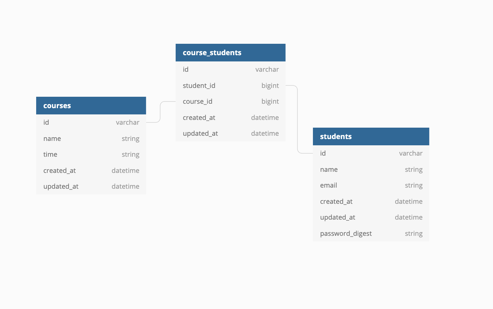

# College Registration

College Registration is a web application in which users can:
- View available courses
- Register for courses
- View their registrations
- Cancel their registrations

## Learning goals:
- Implement a basic CRUD design structure
- Implement a working application with limited time

## Readme Content
- [Getting Started](#getting-started)
- [Running the Tests](#tests)
- [Database Schema](#schema)
- [Author](#author)
- 
## Getting Started
```
git clone git@github.com:dhalverson/college_registration.git
cd college_registration
```

### Prereqisites
- Ruby 2.5.3
- Rails 6.1.2.1

### Setup/Installation
```
bundle install
rails db:{drop,create,migrate,seed}
```

### Local Server
- Navigate to the directory college_registration is located
```
rails s
```
- App will be available locally at http://localhost:3000/

## Tests
- Tests are setup using RSpec
- Run tests using:
```
bundle exec rspec
```

## Schema


## Author
- Daniel Halverson | [github](https://github.com/dhalverson) | [linkedin](https://www.linkedin.com/in/daniel-halverson/)
